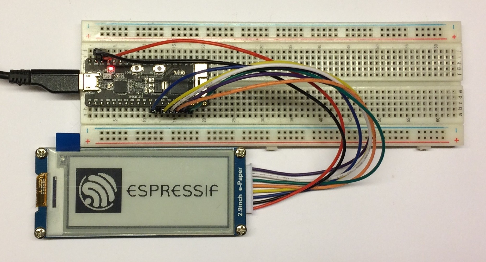
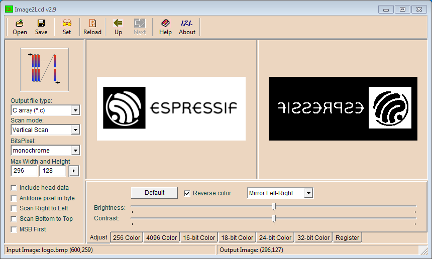

# 2.9" Waveshare ePaper Driver Example

Communicate with [2.9" Waveshare ePaper Module](https://www.waveshare.com/wiki/2.9inch_e-Paper_Module) using SPI interface of [ESP32](http://espressif.com/en/products/hardware/esp32/overview) and [ESP-IDF](https://github.com/espressif/esp-idf) or [Arduino](https://www.arduino.cc/).

* [2.9" Waveshare ePaper Module Datasheet](pictures/2.9inch_e-Paper_Datasheet.pdf)


## About

ePaper displays are great for low power applications. They do not need much energy when operated. They retain the last image at zero energy consumed. You can buy them cheaply as they are produced in high volumes to be used in stores as electronic shelf labels. If your do not need fast update of displayed information, go ahead and use ePaper display for your project! This is what I decided to do. Unfortunately I could not find a driver that would easy integrate into my code. Also documentation how to drive them is still somewhat obscure (December 2017). Fortunately with help of great resources mentioned in [Credits](#credits) I was able to develop the driver I was looking for.




### How to run this example

#### Arduino

The quickest way check this software in action is in [Arduino](https://www.arduino.cc/) environment. It should work with all Arduino boards that have SPI interface. Some concern may be the size of memory to store the image. To display the full memory buffer you need 4736 bytes of RAM. If you do not have enough memory, then you can update display where it changed, using smaller chunks of memory. As this project is oriented to use [ESP32](http://espressif.com/en/products/hardware/esp32/overview) chip, there is no concern, it has more than enough RAM. To load the [application](Arduino/epd2in9-demo) use instructions in [espressif/arduino-esp32](https://github.com/espressif/arduino-esp32) repository.

#### ESP-IDF

To use the [example code](main) with [ESP-IDF](https://github.com/espressif/esp-idf) framework, please follow [ESP32 Get Started](https://esp-idf.readthedocs.io/en/latest/get-started/index.html).


### Wiring of ePaper Module used in example code

| Signal Name | ePaper Module | ESP32 |
| :--- | :---: | :---: |
| Module Busy | BUSY | GPIO22 |
| Reset | RST | GPIO23 |
| Data / Command | DC | GPIO21 |
| Slave Select | CS | GPIO19 |
| Serial Clock | CLK | GPIO18 |
| Master Out Slave In | DIN | GPIO5 |
| Ground | GND | GND |
| Power Supply | 3.3V | 3V3 |


### Example log output

### Arduino

```
Starting...
Init done.
Cleared frame memory.
Displayed welcome text
Displayed image data
Displayed black screen
```

### ESP-IDF

```
I (0) cpu_start: Starting scheduler on APP CPU.
I (259) ePaper Example: Starting example
I (259) ePaper Example: Before ePaper driver init, heap: 297852
I (279) ePaper Driver: SPI data sent 30
I (279) ePaper Example: e-Paper Display Espressif logo
I (279) ePaper Driver: SPI data sent 4736
I (6969) ePaper Example: e-Paper Display sample graphics
I (7039) ePaper Driver: SPI data sent 4736
I (8669) ePaper Example: EPD Display update count: 0
I (8669) ePaper Example: After ePaper driver delete, heap: 302292

```


## Build Status for ESP-IDF

[](https://travis-ci.org/krzychb/esp-epaper-29-ws)


## Documentation for ESP-IDF

[](http://esp-epaper-29-ws.readthedocs.io/en/latest/?badge=latest)


## ESP-IDF Usage Notes

### Changes to the original driver

I have discovered that there are plenty of similar e-paper displays on the market that look exactly the same, but require some modifications in the driver code. In my case I have modified the following:

* Display initialization sequence in function `iot_epaper_spi_init()`
* LUT tables, they differ in size and quantity and dictate how the image is "developed" on the screen
* Commands to to configure image data transfer to the display, two extra functions have been added - `iot_set_ram_area()` and `iot_set_ram_address_counter()`.
* Commands to show up the image
* Other minor things like configuration of checking the BUSY signal, command to put the ePaper into sleep mode, display resolution, etc.


### Optimizing the SPI communication

I have decided to make some updates to the SPI code in original [epaper](https://github.com/espressif/esp-iot-solution/tree/master/components/spi_devices/epaper/test) component. In particular I have configured DMA transfer instead of sending image data byte by byte. Also I have removed pre and post transfer delays.


### Converting pictures

To convert an exiting image to the C header file, use an application recommended by Waveshare in their [Wiki](https://www.waveshare.com/wiki/2.9inch_e-Paper_Module#How_to_display_an_image). See a picture below what parameters to set. I have discovered that you need to mirror the image and this was not documented in the Wiki.




## Contribute

Feel free to contribute to the project in any way you like!

If you find any issues with code or description please report them using *Issues* tab above.


## Credits

This repository has been prepared thanks to great work of the following teams and individuals:

* Espressif team that develops and maintains [esp-idf](https://github.com/espressif/esp-idf)  repository
* esp-iot-solution team that developed cleanly coded [epaper](https://github.com/espressif/esp-iot-solution/tree/master/components/spi_devices/epaper/test) component for another type of display
* Waveshare that provides [great documentation](https://www.waveshare.com/wiki/2.9inch_e-Paper_Module) and [demo code](https://www.waveshare.com/wiki/File:2.9inch_e-Paper_Module_code.7z) for various displays they supply


## License

[Apache License Version 2.0, January 2004](LICENSE)