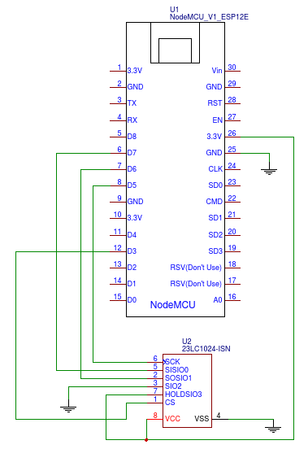

# ESP8266Audio - supports ESP8266 & ESP32 & Raspberry Pi RP2040[](https://gitter.im/ESP8266Audio/community?utm_source=badge&utm_medium=badge&utm_campaign=pr-badge) 
Arduino library for parsing and decoding MOD, WAV, MP3, FLAC, MIDI, AAC, and RTTL files and playing them on an I2S DAC or even using a software-simulated delta-sigma DAC with dynamic 32x-128x oversampling.

ESP8266 is fully supported and most mature, but ESP32 is also mostly there with built-in DAC as well as external ones.

For real-time, autonomous speech synthesis, check out [ESP8266SAM](https://github.com/earlephilhower/ESP8266SAM), a library which uses this one and a port of an ancient format-based synthesis program to allow your ESP8266 to talk with low memory and no network required.

## Disclaimer
All this code is released under the GPL, and all of it is to be used at your own risk.  If you find any bugs, please let me know via the GitHub issue tracker or drop me an email.  The MOD and MP3 routines were taken from StellaPlayer and libMAD respectively.  The software I2S delta-sigma 32x oversampling DAC was my own creation, and sounds quite good if I do say so myself.

The AAC decode code is from the Helix project and licensed under RealNetwork's RSPL license.  For commercial use you're still going to need the usual AAC licensing from [Via Licensing](http://www.via-corp.com/us/en/licensing/aac/overview.html).

On the ESP32, AAC-SBR is supported (many webradio stations use this to reduce bandwidth even further).  The ESP8266, however, does not support it due to a lack of onboard RAM.

MIDI decoding comes from a highly ported [MIDITONES](https://github.com/LenShustek/miditones) combined with a massively memory-optimized [TinySoundFont](https://github.com/schellingb/TinySoundFont), see the respective source files for more information.

Opus, OGG, and OpusFile are from [Xiph.org](https://xiph.org) with the Xiph license and patent described in src/{opusfile,libggg,libopus}/COPYING..  **NOTE** Opus decoding currently only works on the ESP32 due to the large memory requirements of opusfile.  PRs to rewrite it to be less memory intensive would be much appreciated.

## Neat Things People Have Done With ESP8266Audio
If you have a neat use for this library, [I'd love to hear about it](mailto:earlephilhower@yahoo.com)!

My personal use of the ESP8266Audio library is only to drive a 3D-printed, network-time-setting alarm clock for my kids which can play an MP3 instead of a bell to wake them up, called [Psychoclock](https://github.com/earlephilhower/psychoclock).

Harald Sattler has built a neat German [word clock with MP3 alarm](http://www.harald-sattler.de/html/mini-wecker.htm). Detailed discussion on the process and models are included.

Erich Heinemann has developed a Stomper (instrument for playing samples in real-time during a live stage performance) that you can find more info about [here](https://github.com/ErichHeinemann/hman-stomper).

Dagnall53 has integrated this into a really neat MQTT based model train controller to add sounds to his set.  More info is available [here](https://github.com/dagnall53/ESPMQTTRocnetSound), including STL files for 3D printed components!

JohannesMTC has built a similar project especially for model trains: https://github.com/JohannesMTC/ESP32_MAS

A neat MQTT-driven ESP8266 light-and-sound device (alarm? toy? who can say!) was built by @CosmicMac, available at https://github.com/CosmicMac/ESParkle

A very interesting "linear clock" with a stepper motor, NTP time keeping, and configurable recorded chimes with schematics, 3D printer plans, and source code, is now available https://janderogee.com/projects/linear_clock/linear_clock.htm

Source and instructions for a gorgeous wooden MP3-playing clock, FM radio and a walkie-talkie using the ESP8266 and AVR microcontrollers is available https://github.com/zduka/mp3-player

## Prerequisites
First, make sure you are running the 2.6.3/later or GIT head version of the Arduino libraries for ESP8266, or the latest ESP32 SDK from Espressif.

You can use GIT to pull right from GitHub: see [this README](https://github.com/esp8266/Arduino/blob/master/README.md#using-git-version) for detailed instructions.

## Installation
Install the library in your ~/Arduino/libraries
```sh
mkdir -p ~/Arduino/libraries
cd ~/Arduino/libraries
git clone https://github.com/earlephilhower/ESP8266Audio
```

When in the IDE please select the following options on the ESP8266:
```
Tools->lwIP Variant->v1.4 Open Source, or V2 Higher Bandwidth
Tools->CPU Frequency->160MHz
```

## Usage
Create an AudioInputXXX source pointing to your input file, an AudioOutputXXX sink as either an I2S, I2S-sw-DAC, or as a "SerialWAV" which simply writes a WAV file to the Serial port which can be dumped to a file on your development system, and an AudioGeneratorXXX to actually take that input and decode it and send to the output.

After creation, you need to call the AudioGeneratorXXX::loop() routine from inside your own main loop() one or more times.  This will automatically read as much of the file as needed and fill up the I2S buffers and immediately return.  Since this is not interrupt driven, if you have large delay()s in your code, you may end up with hiccups in playback.  Either break large delays into very small ones with calls to AudioGenerator::loop(), or reduce the sampling rate to require fewer samples per second.

## Example
See the examples directory for some simple examples, but the following snippet can play an MP3 file over the simulated I2S DAC:
```cpp
#include <Arduino.h>
#include "AudioFileSourceSPIFFS.h"
#include "AudioGeneratorMP3.h"
#include "AudioOutputI2SNoDAC.h"

AudioGeneratorMP3 *mp3;
AudioFileSourceSPIFFS *file;
AudioOutputI2SNoDAC *out;
void setup()
{
  Serial.begin(115200);
  delay(1000);
  SPIFFS.begin();
  file = new AudioFileSourceSPIFFS("/jamonit.mp3");
  out = new AudioOutputI2SNoDAC();
  mp3 = new AudioGeneratorMP3();
  mp3->begin(file, out);
}

void loop()
{
  if (mp3->isRunning()) {
    if (!mp3->loop()) mp3->stop(); 
  } else {
    Serial.printf("MP3 done\n");
    delay(1000);
  }
}
```

## AudioFileSource classes
AudioFileSource:  Base class which implements a very simple read-only "file" interface.  Required because it seems everyone has invented their own filesystem on the Arduino with their own unique twist.  Using this wrapper lets that be abstracted and makes the AudioGenerator simpler as it only calls these simple functions.

AudioFileSourceSPIFFS:  Reads a file from the SPIFFS filesystem

AudioFileSourcePROGMEM:  Reads a file from a PROGMEM array.  Under UNIX you can use "xxd -i file.mp3 > file.h" to get the basic format, then add "const" and "PROGMEM" to the generated array and include it in your sketch.  See the example .h files for a concrete example.

AudioFileSourceHTTPStream:  Simple implementation of a streaming HTTP reader for ShoutCast-type MP3 streaming.  Not yet resilient, and at 44.1khz 128bit stutters due to CPU limitations, but it works more or less.

## AudioFileSourceBuffer - Double buffering, useful for HTTP streams
AudioFileSourceBuffer is an input source that simply adds an additional RAM buffer of the output of any other AudioFileSource.  This is particularly useful for web streaming where you need to have 1-2 packets in memory to ensure hiccup-free playback.

Create your standard input file source, create the buffer with the original source as its input, and pass this buffer object to the generator.
```cpp
...
AudioGeneratorMP3 *mp3;
AudioFileSourceHTTPStream *file;
AudioFileSourceBuffer *buff;
AudioOutputI2SNoDAC *out;
...
  // Create the HTTP stream normally
  file = new AudioFileSourceHTTPStream("http://your.url.here/mp3");
  // Create a buffer using that stream
  buff = new AudioFileSourceBuffer(file, 2048);
  out = new AudioOutputI2SNoDAC();
  mp3 = new AudioGeneratorMP3();
  // Pass in the *buffer*, not the *http stream* to enable buffering
  mp3->begin(buff, out);
...

```

## AudioFileSourceID3 - ID3 stream parser filter with a user-specified callback
This class, which takes as input any other AudioFileSource and outputs an AudioFileSource suitable for any decoder, automatically parses out ID3 tags from MP3 files.  You need to specify a callback function, which will be called as tags are decoded and allow you to update your UI state with this information.  See the PlayMP3FromSPIFFS example for more information.

## AudioGenerator classes
AudioGenerator:  Base class for all file decoders.  Takes a AudioFileSource and an AudioOutput object to get the data from and to write decoded samples to.  Call its loop() function as often as you can to ensure the buffers are always kept full and your music won't skip.

AudioGeneratorWAV:  Reads and plays Microsoft WAVE (.WAV) format files of 8 or 16 bits.

AudioGeneratorMOD:  Reads and plays Amiga ModTracker files (.MOD).  Use a 160MHz clock as this requires tons of SPIFFS reads (which are painfully slow) to get raw instrument sample data for every output sample.  See https://modarchive.org for many free MOD files.

AudioGeneratorMP3:  Reads and plays MP3 format files (.MP3) using a ported libMAD library.  Use a 160MHz clock to ensure enough compute power to decode 128KBit 44.1KHz without hiccups.  For complete porting history with the gory details, look at https://github.com/earlephilhower/libmad-8266

AudioGeneratorFLAC:  Plays FLAC files via ported libflac-1.3.2.  On the order of 30KB heap and minimal stack required as-is.

AudioGeneratorMIDI:  Plays a MIDI file using a wavetable synthesizer and a SoundFont2 wavetable input.  Theoretically up to 16 simultaneous notes available, but depending on the memory needed for the SF2 structures you may not be able to get that many before hitting OOM.

AudioGeneratorAAC:  Requires about 30KB of heap and plays a mono or stereo AAC file using the Helix fixed-point AAC decoder.

AudioGeneratorRTTTL:  Enjoy the pleasures of monophonic, 4-octave ringtones on your ESP8266.  Very low memory and CPU requirements for simple tunes.

## AudioOutput classes
AudioOutput:  Base class for all output drivers.  Takes a sample at a time and returns true/false if there is buffer space for it.  If it returns false, it is the calling object's (AudioGenerator's) job to keep the data that didn't fit and try again later.

AudioOutputI2S: Interface for any I2S 16-bit DAC.  Sends stereo or mono signals out at whatever frequency set.  Tested with Adafruit's I2SDAC and a Beyond9032 DAC from eBay.  Tested up to 44.1KHz. To use the internal DAC on ESP32, instantiate this class as `AudioOutputI2S(0,1)`, see example `PlayMODFromPROGMEMToDAC` and code in [AudioOutputI2S.cpp](src/AudioOutputI2S.cpp#L29) for details.

AudioOutputI2SNoDAC:  Abuses the I2S interface to play music without a DAC.  Turns it into a 32x (or higher) oversampling delta-sigma DAC.  Use the schematic below to drive a speaker or headphone from the I2STx pin (i.e. Rx).  Note that with this interface, depending on the transistor used, you may need to disconnect the Rx pin from the driver to perform serial uploads.  Mono-only output, of course.

AudioOutputSPDIF (experimental): Another way to abuse the I2S peripheral to send out BMC encoded S/PDIF bitstream. To interface with S/PDIF receiver it needs optical or coaxial transceiver, for which some examples can be found at https://www.epanorama.net/documents/audio/spdif.html. It should work even with the simplest form with red LED and current limiting resistor, fed into TOSLINK cable. Minimum sample rate supported by is 32KHz. Due to BMC coding, actual symbol rate on the pin is 4x normal I2S data rate, which drains DMA buffers quickly. See more details inside [AudioOutputSPDIF.cpp](src/AudioOutputSPDIF.cpp#L17)

AudioOutputSerialWAV:  Writes a binary WAV format with headers to the Serial port.  If you capture the serial output to a file you can play it back on your development system.

AudioOutputSPIFFSWAV:  Writes a binary WAV format with headers to a SPIFFS filesystem.  Ensure the FS is mounted and SPIFFS is started before calling.  USe the SetFilename() call to pick the output file before starting.

AudioOutputNull:  Just dumps samples to /dev/null.  Used for speed testing as it doesn't artificially limit the AudioGenerator output speed since there are no buffers to fill/drain.

## I2S DACs
I've used both the Adafruit [I2S +3W amp DAC](https://www.adafruit.com/product/3006) and a generic PCM5102 based DAC with success.  The biggest problems I've seen from users involve pinouts from the ESP8266 for GPIO and hooking up all necessary pins on the DAC board. The essential pins are:

I2S pin | Common label* | ESP8266 pin 
--------|---------------|-------------
LRC     | D4            | GPIO2
BCLK    | D8            | GPIO15
DIN     | RX            | GPIO3

\* The "common label" column applies to common NodeMCU and D1 Mini development boards. Unfortunately some manufacturers use different mappings so the labels listed here might not apply to your particular model.

### Adafruit I2S DAC
This is quite simple and only needs the GND, VIN, LRC, BCLK< and DIN pins to be wired.  Be sure to use +5V on the VIN to get the loudest sound.  See the [Adafruit example page](https://learn.adafruit.com/adafruit-max98357-i2s-class-d-mono-amp) for more info.

### PCM5102 DAC
I've used several versions of PCM5102 DAC boards purchased from eBay.  They've all had the same pinout, no matter the form factor.  There are several input configuration pins beyond the I2S interface itself that need to be wired:
* 3.3V from ESP8266 -> VCC, 33V, XMT
* GND from ESP8266 -> GND, FLT, DMP, FMT, SCL
* (Standard I2S interface) BCLK->BCK, I2SO->DIN, and LRCLK(WS)->LCK


### Others
There are many other variants out there, and they should all work reasonably well with this code and the ESP8266.  Please be certain you've read the datasheet and are applying proper input voltages, and be sure to tie off any unused inputs to GND or VCC as appropriate.  LEaving an input pin floating on any integrated circuit can cause unstable operation as it may pick up noise from the environment (very low input capacitance) and cause havoc with internal IC settings.

## Software I2S Delta-Sigma DAC (i.e. playing music with a single transistor and speaker)
For the best fidelity, and stereo to boot, spend the money on a real I2S DAC.  Adafruit makes a great mono one with amplifier, and you can find stereo unamplified ones on eBay or elsewhere quite cheaply.  However, thanks to the software delta-sigma DAC with 32x oversampling (up to 128x if the audio rate is low enough) you can still have pretty good sound!

Use the `AudioOutputI2S*No*DAC` object instead of the `AudioOutputI2S` in your code, and the following schematic to drive a 2-3W speaker using a single $0.05 NPN 2N3904 transistor and ~1K resistor:

```
                            2N3904 (NPN)
                            +---------+
                            |         |     +-|
                            | E  B  C |    / S|
                            +-|--|--|-+    | P|
                              |  |  +------+ E|
                              |  |         | A|
ESP8266-GND ------------------+  |  +------+ K| 
                                 |  |      | E|
ESP8266-I2SOUT (Rx) -----/\/\/\--+  |      \ R|
                                    |       +-|
USB 5V -----------------------------+

You may also want to add a 220uF cap from USB5V to GND just to help filter out any voltage droop during high volume playback.
```
If you don't have a 5V source available on your ESP model, you can use the 5V from your USB serial adapter, or even the 3V from the ESP8266 (but it'll be lower volume).  Don't try and drive the speaker without the transistor, the ESP8266 pins can't give enough current to drive even a headphone well and you may end up damaging your device.

Connections are as a follows:
```
ESP8266-RX(I2S tx) -- Resistor (~1K ohm, not critical) -- 2N3904 Base
ESP8266-GND        -- 2N3904 Emitter
USB-5V             -- Speaker + Terminal
2N3904-Collector   -- Speaker - Terminal
```

*NOTE*:  A prior version of this schematic had a direct connection from the ESP8266 to the base of the transistor.  While this does provide the maximum amplitude, it also can draw more current from the 8266 than is safe, and can also cause the transistor to overheat.

As of the latest ESP8266Audio release, with the software delta-sigma DAC the LRCLK and BCLK pins *can* be used by an application.  Simply use normal `pinMode` and `dicitalWrite` or `digitalRead` as desired.

### High pitched buzzing with the 1-T circuit
The 1-T amp can _NOT_ drive any sort of amplified speaker.  If there is a power or USB input to the speaker, or it has lights or Bluetooth or a battery, it can _NOT_ be used with this circuit.

The 1T output is a binary signal at 0 or 5V, with nothing in between. When you connect to a 8ohm paper physical speaker directly, the speaker cone itself has inertia and acts as a low pass filter and averages the density of pulses in order to give a nice, analog output.

When you feed the 1T output to an amp you are alternatively grounding and overdriving the op-amp's input at a high frequency. That causes ringing and the opamp has a frequency response high enough to amplify the high frequency noise and you get that buzzing.

The same problem may happen with piezo speakers. They have a very high frequency response, normally, and have (almost) no inertia. So you hear the buzzing at high frequency.

You could attach the 1T output to a low pass and feed that into an amplifier. But at that point it is easier to just get an I2S DAC and avoid the whole thing (plus get stereo and true 16-bit output).

### Debugging the 1-T amp circuit, compliments of @msmcmickey
If you've built the amp but are not getting any sound, @msmcmickey wrote up a very good debugging sequence to check:

0. Please double-check the wiring.  GPIO pins and board pins are not always the same and vary immensely between brands of ESP8266 carrier boards.
1. Is the transistor connected properly? Check the datasheet for this package style and make sure you have the leads connected properly. This package has three leads, and the lead that is by itself in the middle of the one side is the collector, not the base as you might expect it to be.
2. If connected properly, do you have ~5 volts between the collector and emitter?
3.  Was the transistor possibly damaged/overheated during soldering, or by connecting it improperly? Out-of-circuit diode check voltage drop test using a multimeter from base->emitter and base->collector should be between .5 and .7 volts. If it's shorted or open or conducting in both directions, then replace it and make sure it's connected properly.

## SPDIF optical output 
The proper way would be using optical TOSLINK transmitter (i.e. TOTXxxx). For testing, you can try with ~660nm red LED and resistor. Same as your basic Blink project with external LED, just that the LED will blink a bit faster. 
```
                ____
ESP Pin -------|____|--------+ 
                             | 
                            --- 
                             V LED 
                            --- 
                             |
Ground  ---------------------+
```
For ESP8266 with red LED (~1.9Vf drop) you need minimum 150Ohm resistor (12mA max per pin), and output pin is fixed (GPIO3/RX0).On ESP32 it is confgurable with `AudioOutputSPDIF(gpio_num)`.

## Using external SPI RAM to increase buffer
A class allows you to use a 23lc1024 SPI RAM from Microchip as input buffer. This chip connects to ESP8266 HSPI port and provides a large buffer to help avoid hiccus in playback of web streams.

The current version allows for using the standard hardware CS (GPIO15) or any other pin via software at slightly less performance.  The following schematic shows one example:



## Notes for using SD cards and ESP8266Audio on Wemos shields
I've been told the Wemos SD card shield uses GPIO15 as the SD chip select.  This needs to be changed because GPIO15 == I2SBCLK, and is driven even if you're using the NoDAC option.  Once you move the CS to another pin and update your program it should work fine.

## Porting to other microcontrollers
There's no ESP8266-specific code in the AudioGenerator routines, so porting to other controllers should be relatively easy assuming they have the same endianness as the Xtensa core used.  Drop me a line if you're doing this, I may be able to help point you in the right direction.

## Thanks
Thanks to the authors of StellaPlayer and libMAD for releasing their code freely, and to the maintainers and contributors to the ESP8266 Arduino port.

Also, big thanks to @tueddy for getting the initial ESP32 porting into the tree!

-Earle F. Philhower, III
 earlephilhower@yahoo.com

