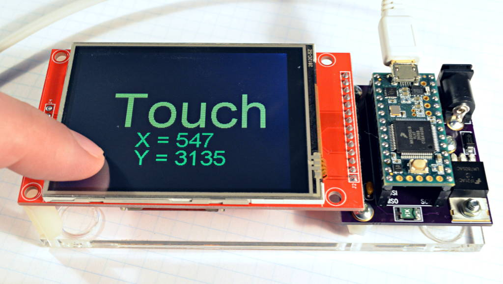

# XPT2046 Touchscreen Arduino Library

XPT2046_Touchscreen is a library for the XPT2046 resistive touchscreen controllers used on many low cost TFT displays.

## Setup Functions

First, create an instance of the library for your touchscreen.  The digital pin
used for chip select is required.  The normal MISO, MOSI and SCK pins will be
used automatically.

    #define CS_PIN  8
    XPT2046_Touchscreen ts(CS_PIN);

The use of the Touch interrupt pin can be optionally specified. If the Teensy
pin specified is actively connected to the T_IRQ display pin then the normal
touch calls will respond, but can be called more often as each call returns
without hardware access when no interrupt was recorded.

    #define TIRQ_PIN  2
    XPT2046_Touchscreen ts(CS_PIN, TIRQ_PIN);

In setup(), use the begin() function to initialize the touchscreen, and
optionally use setRotation(n), where n is 0 to 3, matching the rotation
setting in ILI9341_t3, Adafruit_ILI9341 or other Adafruit compatible TFT
libraries.

      ts.begin();
      ts.setRotation(1);

## Reading Touch Info

The touched() function tells if the display is currently being touched,
returning true or false.

      if (ts.touched()) {
        // do something....
      }

You can read the touch coordinates with readData()

      uint16_t x, y, z;
      ts.readData(&x, &y, &z);

or with getPoint(), which returns a TS_Point object:

      TS_Point p = ts.getPoint();
      Serial.print("x = ");
      Serial.print(p.x);
      Serial.print(", y = ");
      Serial.print(p.y);

The Z coordinate represents the amount of pressure applied to the screen.

## Adafruit Library Compatibility

XPT2046_Touchscreen is meant to be a compatible with sketches written for Adafruit_STMPE610, offering the same functions, parameters and numerical ranges as Adafruit's library.

## Using The Interrupt Pin : Built in support when connected nothing else is needed. When specified as above
no SPI calls are made unless a Touch was detected.  On normal connections - this means the Teensy LED
won't blink on every touch query.

## Using The Interrupt Pin : Custom use would preclude the normal built in usage. The warning below is justified.

The XPT2046 chip has an interrupt output, which is typically labeled T_IRQ on many low cost TFT displays.  No special software support is needed in this library.  The interrupt pin always outputs a digital signal related to the touch controller signals, which is LOW when the display is touched.  It also is driven low while software reads the touch position.

The interrupt can be used as a wakeup signal, if you put your microcontroller into a deep sleep mode.  Normally, you would stop reading the touch data, then enable the interrupt pin with attachInterrupt(), and then configure your processor to wake when the interrupt occurs, before enter a deep sleep mode.  Upon waking, you would normally disable the interrupt before reading the display, to prevent false interrupts caused by the process of reading touch positions.

You can also use the interrupt to respond to touch events.  Setup might look similar to this:

      SPI.usingInterrupt(digitalPinToInterrupt(pin))
      attachInterrupt(digitalPinToInterrupt(pin), myFunction, FALLING);

However, inside your interrupt function, if the display is no longer being touched, any attempt to read the touch position will cause the interrupt pin to create another falling edge.  This can lead to an infinite loop of falsely triggered interrupts.  Special care is needed to avoid triggering more interrupts on the low signal due to reading the touch position.

For most applications, regularly reading the touch position from the main program is much simpler.

