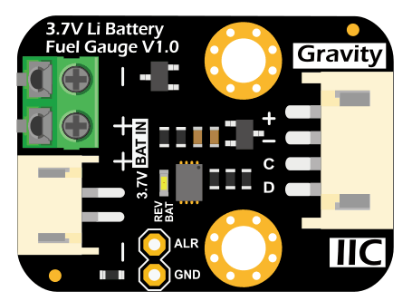

# DFRobot_MAX17043

* [English Version](./README.md)

Gravity 3.7V锂电池电量计使用Gravity I2C接口，超低工作电流，通过Maxim专利算法，实时跟踪电池的相对充电状态(SOC，State-Of-Charge)，无需充放电学习过程，无积累误差，即插即用，准确地测量锂电池的当前电压和剩余电量。模块预留低电量报警中断引脚，当电池电量低于指定电量时，该引脚产生一个下跳脉冲，触发主控的外部中断。

 


## 产品链接（[https://www.dfrobot.com.cn/goods-1743.html](https://www.dfrobot.com.cn/goods-1743.html)）
    SKU: DFR0563
   
## 目录

* [概述](#概述)
* [连接](连接)
* [库安装](#库安装)
* [方法](#方法)
* [兼容性](#兼容性)
* [历史](#历史)
* [创作者](#创作者)

## 概述
提供 microPython 库，用于通过 I2C 读取和解释 MAX17043 数据

## 连接
相同颜色的线连接在一起，我们只举例说明主板是如何连接到电量计的。接线时要注意管脚的对应关系，接线图如下：

* ESP32

<br>

<br>


## 库安装

要使用此库，请下载 zip 文件，将其解压缩到 upyCraft 工作区中名为 DFRobot_MAX17043 的文件夹中。

## 方法

```python
  '''!
    @brief 构造MAX17043对象
    @return MAX17043 初始化
    @retval 0     成功
    @retval -1    失败
  '''
  def begin(self):
    
  '''!
    @brief 读电池电压，单位： mV
    @return 电池电压，单位：mV
  '''    
  def read_voltage(self):
    
  '''!
    @brief 读取剩余电池容量的百分比
    @return 剩余电池容量的百分比
  '''
  def read_percentage(self):
  '''!
    @brief 设置 MAX17043 中断阈值
    @param per       中断阈值范围： %1 - 32% (整数)
  '''
  def set_interrupt(self, per):
    
  '''!
    @brief 清除 MAX17043 中断.
  '''
  def clear_interrupt(self):
    
  '''!
    @brief 设置 MAX17043 进入睡眠模式
  '''
  def set_sleep(self):
    
  '''!
    @brief 唤醒 MAX17043
  ''' 
  def set_wakeup(self):
```

## 兼容性

| MCU                | Work Well | Work Wrong | Untested | Remarks |
| ------------------ | :-------: | :--------: | :------: | ------- |
|      ESP32         | √         |            |          |

## 历史

- 2018/04/14 - 1.0.0 版本

## 创作者

Written by ouki.wang(ouki.wang@dfrobot.com), 2018. (Welcome to our [website](https://www.dfrobot.com/))

