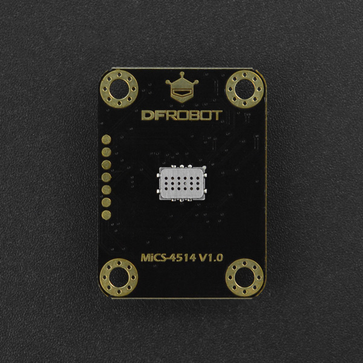

# DFRobot_MICS
- [中文版](./README_CN.md)

This is a 3.3/5V compatible MEMS gas concentration sensor from DFRobot. This sensor supports the detection of various gas concentrations like CO, C2H5OH (Alcohol), H2, NO2, NH3, and integrates various gas concentration conversion formulas in the code to facilitate the testing and use of sensors. With I2C output and 3.3~5.5V wide voltage input, it is compatible with Arduino, ESP32, Raspberry Pi and other mainstream controllers.<br>




## Product Link(https://www.dfrobot.com/product-2417.html)

    SKU:SEN0377

## Table of Contents

* [Summary](#Summary)
* [Installation](#Installation)
* [Methods](#Methods)
* [Compatibility](#Compatibility)
* [History](#History)
* [Credits](#Credits)

## Summary

- Detection of Physical Quantities: gas concentration of CO,C2H5OH(Alcohol), H2, NO2, NH3, CH4<br>
- Operating Voltage: 3.3～5.5V DC<br>
- Power Dissipation: 0.45W(5V)<br>
- Output Signal: I2C(0~3V)<br>
- Measuring Range:<br>
1 – 1000ppm(Carbon monoxide CO )<br>
0.05 – 10ppm(Nitrogen dioxide NO2 )<br>
10 – 500ppm( Ethanol C2H5OH )<br>
1 – 1000ppm(Hydrogen H2)<br>
1 – 500ppm(Ammonia NH3 )<br>
1000 - ∞ ppm(Methane CH4 )<br>
- Working Temperature: -30～85℃<br>
- Working Humidity: 5～95%RH (No condensation)<br>
- Storage Temperature: -40~85℃<br>
- Lifespan: >2 years (in the air)<br>
- Circuit Board Size: 27mm*37mm<br>
- Mounting Hole Size: inner diameter 3.1mm/outer diameter 6mm<br>

## Installation
There are two methods for using this library:<br>
1. Open Arduino IDE, search for "DFRobot_MICS" on the status bar in Tools ->Manager Libraries and install the library.<br>
2. Download the library file before use, paste it into \Arduino\libraries directory, then open the examples folder and run the demo in the folder.<br>

## Methods

```C++
  /**
   * @fn warmUpTime
   * @brief Waiting time for warm-up
   * @param minute Units of minutes
   * @return bool type
   * @retval true  is warm-up success
   * @retval false is wait warm-up
   */
  bool warmUpTime(uint8_t minute);

  /**
   * @fn getADCData
   * @brief Read sensor ADC data
   * @param mode oxmode redmode
   * @n     OX_MODE
   * @n     RED_MODE
   * @return adcValue (0-1024)
   */
  int16_t getADCData(uint8_t mode);

  /**
   * @fn getGasData
   * @brief Read the concentration of the gas
   * @param type gas type
   * @n   Methane          (CH4)    (1000 - 25000)PPM
   * @n   Ethanol          (C2H5OH) (10   - 500)PPM
   * @n   Hydrogen         (H2)     (1    - 1000)PPM
   * @n   Ammonia          (NH3)    (1    - 500)PPM
   * @n   Carbon Monoxide  (CO)     (1    - 1000)PPM
   * @n   Nitrogen Dioxide (NO2)    (0.1  - 10)PPM
   * @return concentration Units of PPM
   */
  float getGasData(uint8_t type);

   /**
   * @fn getGasExist
   * @brief Read whether the gas is present
   * @param gas type
   * @n   CO       = 0x01  (Carbon Monoxide)
   * @n   CH4      = 0x02  (Methane)
   * @n   C2H5OH   = 0x03  (Ethanol)
   * @n   C3H8     = 0x04  (Propane)
   * @n   C4H10    = 0x05  (Iso Butane)
   * @n   H2       = 0x06  (Hydrogen)
   * @n   H2S      = 0x07  (Hydrothion)
   * @n   NH3      = 0x08  (Ammonia)
   * @n   NO       = 0x09  (Nitric Oxide)
   * @n   NO2      = 0x0A  (Nitrogen Dioxide)
   * @return state
   * @retval NO_EXIST
   * @retval EXIST
   */
  int8_t getGasExist(uint8_t gas);

  /**
   * @fn sleepMode
   * @brief Sleep sensor
   */ 
  void sleepMode(void);

  /**
   * @fn wakeUpMode
   * @brief wakeup sensor
   */ 
  void wakeUpMode(void);

  /**
   * @fn getPowerState
   * @brief Gets the power mode of the sensor
   * @return state
   * @retval SLEEP_MODE
   * @retval WAKE_UP_MODE
   */ 
  uint8_t getPowerState(void);

```

## Compatibility

MCU                | Work Well    | Work Wrong   | Untested    | Remarks
------------------ | :----------: | :----------: | :---------: | :----:
Arduino Uno        |      √       |              |             |
Arduino MEGA2560   |      √       |              |             |
Arduino Leonardo   |      √       |              |             |
FireBeetle-ESP32   |      √       |              |             |
Micro:bit          |              |              |      √      |


## History

- 2021/1/13 - V1.0.0 Version
- 2021/4/20 - V1.1.0 Version
- 2021/7/18 - V1.2.0 Version

## Credits

Written by ZhixinLiu(zhixin.liu@dfrobot.com), 2020. (Welcome to our [website](https://www.dfrobot.com/))
