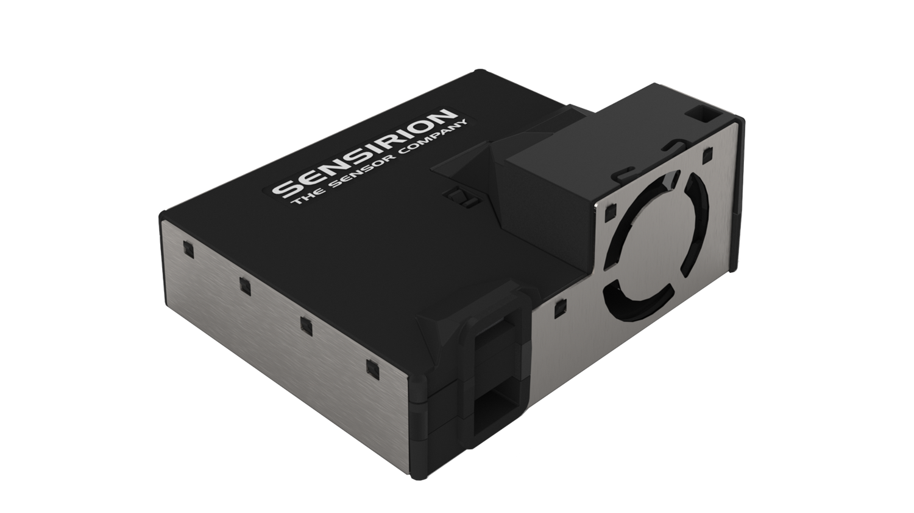
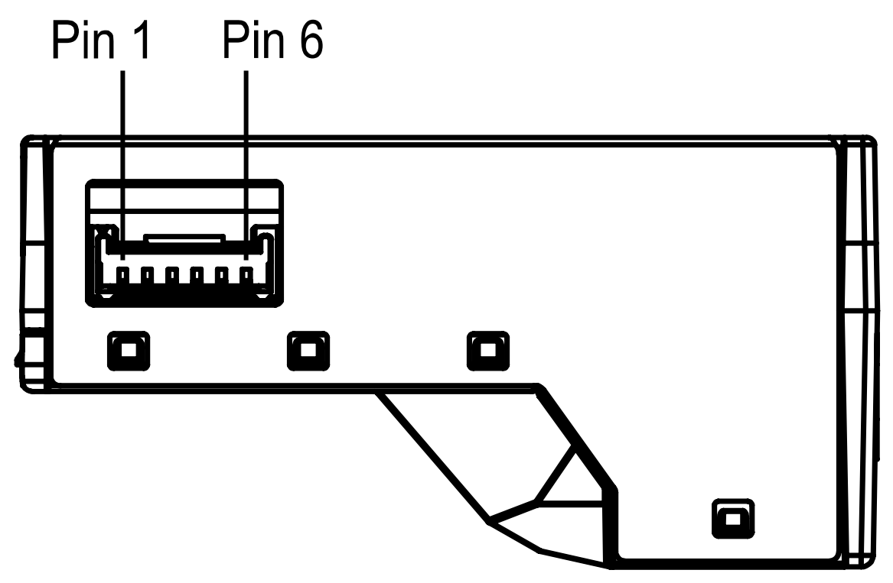

<!-- Downloaded from https://github.com/Sensirion/arduino-i2c-sen5x
on 10/01/2023 at commit d7a73c86073cca34b84cde83814f5c17b87aad6d -->
# Sensirion I2C SEN5X Arduino Library

This is the Sensirion SEN5X library for Arduino using the
modules I2C interface.

<center></center>

## Supported sensors

- SEN50 (only particulate matter signals available)
- SEN54 (no NOx signal available)
- SEN55 (full feature set)

# Installation

To install, download the latest release as .zip file and add it to your
[Arduino IDE](http://www.arduino.cc/en/main/software) via

	Sketch => Include Library => Add .ZIP Library...

Don't forget to **install the dependencies** listed below the same way via `Add
.ZIP Library`

Note: Installation via the Arduino Library Manager is coming soon.

# Dependencies

* [Sensirion Core](https://github.com/Sensirion/arduino-core)


# Quick Start

1. Connect the SEN5X Sensor to your Arduino board's standard
   I2C bus. Check the pinout of your Arduino board to find the correct pins.
   The pinout of the SEN5X Sensor board can be found in the
   data sheet.

   | *SEN5X* | *Arduino*   | *Jumper Wire* |
   | ------- | ----------- | ------------- |
   | VCC     | 5V          | Red           |
   | GND     | GND         | Black         |
   | SDA     | SDA         | Green         |
   | SCL     | SCL         | Yellow        |
   | SEL     | GND for I2C | Blue          |

   <center></center>

   | *Pin* | *Name* | *Description*                   | *Comments*                       |
   | ----- | ------ | ------------------------------- | -------------------------------- |
   | 1     | VCC    | Supply Voltage                  | 5V ±10%                          |
   | 2     | GND    | Ground                          |
   | 3     | SDA    | I2C: Serial data input / output | TTL 5V and LVTTL 3.3V compatible |
   | 4     | SCL    | I2C: Serial clock input         | TTL 5V and LVTTL 3.3V compatible |
   | 5     | SEL    | Interface select                | Pull to GND to select I2C        |
   | 6     | NC     | Do not connect                  |

2. Open the `exampleUsage` sample project within the Arduino IDE

		File => Examples => Sensirion I2C SEN5X => exampleUsage

3. Click the `Upload` button in the Arduino IDE or

		Sketch => Upload

4. When the upload process has finished, open the `Serial Monitor` or `Serial
   Plotter` via the `Tools` menu to observe the measurement values. Note that
   the `Baud Rate` in the corresponding window has to be set to `115200 baud`.

# Contributing

**Contributions are welcome!**

We develop and test this driver using our company internal tools (version
control, continuous integration, code review etc.) and automatically
synchronize the master branch with GitHub. But this doesn't mean that we don't
respond to issues or don't accept pull requests on GitHub. In fact, you're very
welcome to open issues or create pull requests :)

This Sensirion library uses
[`clang-format`](https://releases.llvm.org/download.html) to standardize the
formatting of all our `.cpp` and `.h` files. Make sure your contributions are
formatted accordingly:

The `-i` flag will apply the format changes to the files listed.

```bash
clang-format -i src/*.cpp src/*.h
```

Note that differences from this formatting will result in a failed build until
they are fixed.

# License

See [LICENSE](LICENSE).
