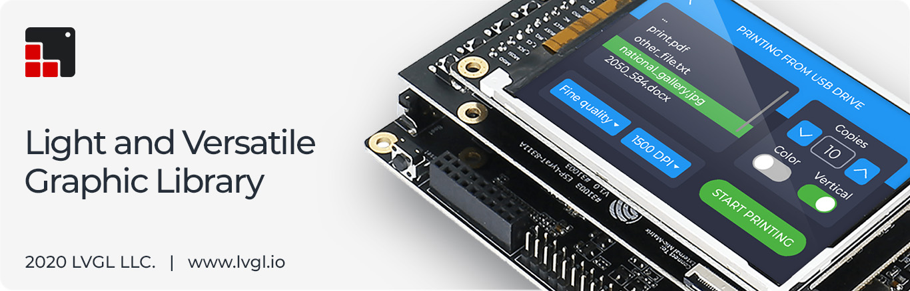
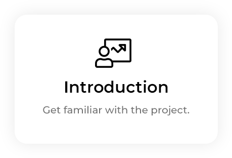
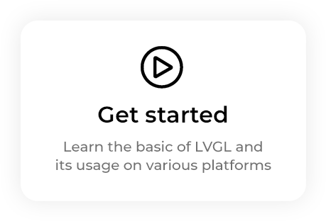
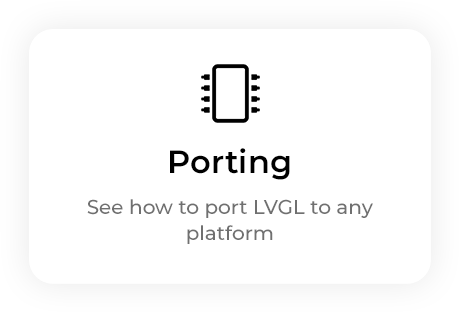
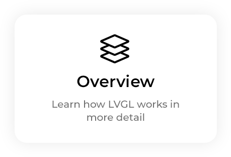
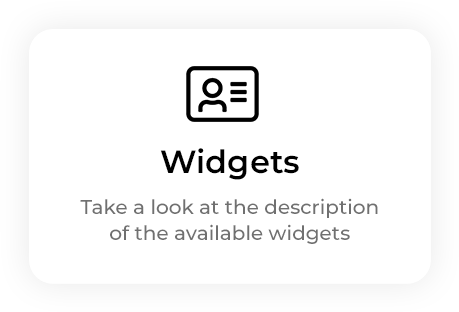
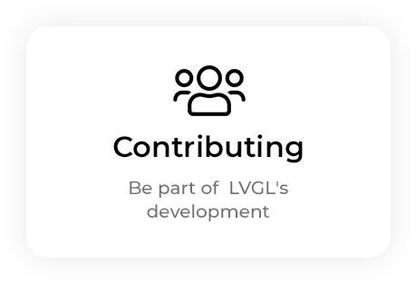

```eval_rst
.. include:: /header.rst 
:github_url: |github_link_base|/index.md
```

```eval_rst

PDF version: :download:`LVGL.pdf <LVGL.pdf>`
```

# Welcome to the documentation of LVGL!




<div style="margin-bottom:48px"> 
    <a href="intro/index.html"></a>
    <a href="get-started/index.html"></a>
    <a href="porting/index.html"></a>
    <a href="overview/index.html"></a>
    <a href="widgets/index.html"></a>
    <a href="CONTRIBUTING.html"></a>
</div> 
 

```eval_rst
.. toctree::
   :maxdepth: 2
   
   intro/index
   get-started/index
   porting/index
   overview/index
   widgets/index
   layouts/index
   CONTRIBUTING
   CHANGELOG
   ROADMAP
```
