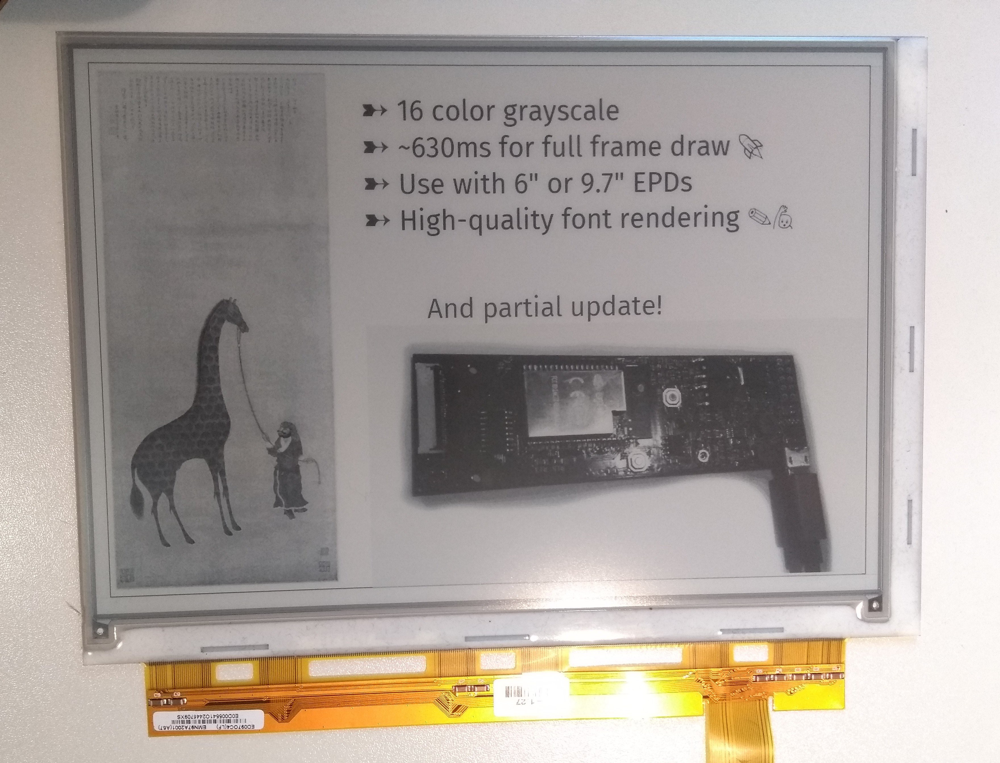
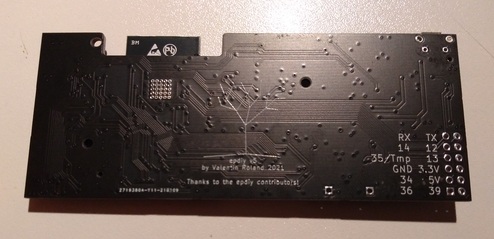

  

EPDiy E-Paper Driver
=======================================

EPDiy is a driver board which talks to affordable E-Paper (or E-Ink) screens, which are usually sold as replacement screens for E-Book readers. Why are they interesting?

* Easy on the eyes and paper-like aesthetics
* No power consumption when not updating
* Sunlight-readable

Ready-made DIY modules for this size and with 4bpp (16 Grayscale) color support are currently quite expensive. This project uses Kindle replacement screens, which are available for 20$ (small) / 30$ (large) on ebay!

The EPDiy driver board targets multiple E-Paper displays. As the driving method for all matrix-based E-ink displays seems to be more or less the same, only the right connector and timings are needed. The EPDiy PCB v5 features 33pin, 34pin and a 39pin connectors, which allow to drive the following display types: ED097OC4, ED060SC4, ED097TC2, ED060SC7. For the full list of supported displays, refer to the table below.

Revision 5 of the board is optimized for the use with LiPo batteries, featuring a LiPo charger and ultra-low deep sleep current.

This project supports a driver for the ESP-IDF and Arduino. For installation instructions, please refer to the [documentation](https://epdiy.readthedocs.io/en/latest/getting_started.html#getting-your-board).

Building It
-----------

If you want to build a board right now, there are two possible routes:

 - Use the new v5 PCB (`hardware/epaper-breakout/gerbers_v5.zip`). 
   **So far, I only tested a prototype of it. The newest gerbers should work, but are untested!**
   **If you have tested them, please let me know!**
   The BOM is available at (`hardware/epaper-breakout/BOM.csv`).
   Positioning files for SMT assembly are available at (`hardware/epaper-breakout/gerbers/epaper-breakout-top-pos.csv`). 
   Please double check the part positioning and Rotation with your assembly service!
   More information on the order process and where to find parts is in the [documentation](https://epdiy.readthedocs.io/en/latest/getting_started.html#getting-your-board).
 
   Make sure to select the `V5` board revision in `idf.py menuconfig` when building the examples.
 
 - Use the old v4 PCB (`hardware/epaper-breakout/gerbers_v4.zip`). This is a bit more fresh, but should work.
   The BOM is available at (`hardware/epaper-breakout/BOM.csv`).
   Positioning files for SMT assembly are available at (`hardware/epaper-breakout/gerbers/epaper-breakout-top-pos.csv`). 
   Please double check the part positioning and Rotation with your assembly service!
 
   Make sure to select the `V4` board revision in `idf.py menuconfig` when building the examples.

Gettings Started
----------------

For instructions and more information visit the [documentation](https://epdiy.readthedocs.io/en/latest/getting_started.html)!

Join the Discussion
----------------

 -  Matrix Community: +epdiy:matrix.vroland.de
 - 

Displays
--------

|Name|Size|Resolution|Compatible|Connector|Pin count|Compatible since pcb version|Notes
| --:      | --:   | --:         | --: | --: | --:                  |--: |--: |
|ED060SC4|6"|800 x 600|yes, tested|FH26W-39S-0.3SHW(60)|39|v2|
|ED097OC4|9.7"|1200 x 825|yes, tested|XF2M-3315-1A|33|V2|Cheap, inferior contrast
|ED097TC2|9.7"|1200 x 825|yes, tested|XF2M-3315-1A|33|V2|Slightly higher price, better contrast
|ED097OC1|9.7"|1200 x 825|yes (should work)|XF2M-3315-1A|33|V2|Cheap, inferior performance
|ED047TC1|4.7"|960 x 540|yes, tested|40-pin|40|LILYGO 4.7" EPD|Supported only by 4.7" e-paper board by LILYGO
|ED133UT2|13.3"|1600 x 1200|yes, tested|adapter board|39|V2|Adapter Board required, also PENG133D
|ED060XC3|6"|758 x 1024|yes, tested|THD0515-34CL-SN|34|V5|Cheapest, good contrast and resolution
|ED060XD4|6"|758 x 1024|yes, tested|THD0515-34CL-SN|34|V5|
|ED060XC5|6"|758 x 1024|yes (should work as ED060XC3)|THD0515-34CL-SN|34|V5|
|ED060XD6|6"|758 x 1024|yes (should work as ED060XC3)|THD0515-34CL-SN|34|V5|
|ED060XH2|6"|758 x 1024|yes (should work as ED060XC3)|THD0515-34CL-SN|34|V5|
|ED060XC9|6"|758 x 1024|yes (should work as ED060XC3)|THD0515-34CL-SN|34|V5|
|ED060KD1|6"|1072 x 1448|yes (should work as ED060XC3)|THD0515-34CL-SN|34|V5|
|ED060KC1|6"|1072 x 1448|yes (should work as ED060XC3)|THD0515-34CL-SN|34|V5|
|ED060SCF|6"|600 x 800|yes, tested|THD0515-34CL-SN|34|V5|Different flex cable shape
|ED060SCN|6"|600 x 800|yes (should work as ED060XC3)|THD0515-34CL-SN|34|V5|Different flex cable shape
|ED060SCP|6"|600 x 800|yes (should work as ED060XC3)|THD0515-34CL-SN|34|V5|Different flex cable shape
|ED060SC7|6"|600 x 800|yes (should work) |AXT434124|34|v5|
|ED060SCG|6"|600 x 800|yes (should work) |AXT434124|34|v5|
| ED060SCE | 6" | 600 x 800 | yes (should work)  | AXT434124 | 34 | v5 |
| ED060SCM | 6" | 600 x 800 | yes (should work)  | AXT434124 | 34 | v5 |
| ED060SCT | 6" | 600 x 800 | yes, tested        | AXT434124 | 34 | v5 |

**Please note that board revision v5 is still in prototype stage!**

Troubleshooting
---------------

The following list is compiled from past experiences and GitHub issues:
 * **The displayed image displays only part of the image.** Make sure to select the correct display type as described [here](https://epdiy.readthedocs.io/en/latest/getting_started.html#selecting-a-display-type).
 * **The existing image fades / darkens when updating a partial screen region.** Make sure the VCOM voltage is [calibrated](https://epdiy.readthedocs.io/en/latest/getting_started.html#calibrate-vcom) for your specific display.
 * **The second third of the image is replaced with the last third.** This seems to be a timing issue we could not yet quite figure out the reason for. For a workarround or suggestions please [join the discussion](https://github.com/vroland/epdiy/issues/15).
 * **The ESP does not boot correctly when external periperals are connected.** Make sure not to pull GPIO12 high during boot, as it is a strapping pin internal voltage selection (https://github.com/vroland/epdiy/issues/17).
 
More on E-Paper Displays
------------------------

 * List of E-Paper devices and their screens: https://e-ink-reader.ru/chg_dsp_en.php (thanks, @mcer12)
 * Reverse engineering of display pins, possible starting point for alternative drivers: https://linux-sunxi.org/PocketBook_Touch_Lux_3 (thanks, @mcer12)
 * Reverse engineering and explanation on driving EPDs: http://essentialscrap.com/eink/index.html
 * Earlier take on driving 6" EPDs with an ESP32, basis of original power circuit: http://spritesmods.com/?art=einkdisplay&page=1
 * Related Hackaday projects: https://hackaday.io/project/21607 https://hackaday.io/project/11537

If you know any other useful resources or have suggestions, please comment on #31!

Hackaday Project
----------------

For more details, see the project page on Hackaday: https://hackaday.io/project/168193-epdiy-976-e-paper-controller

Licenses
--------

The weather example is Copyright (c) David Bird 2018 (except for minor modifications). Please refer to `examples/weather/README.md` for details.

The board and schematic are licensed under a  <a rel="license" href="https://creativecommons.org/licenses/by-sa/4.0/">Creative Commons Attribution-ShareAlike 4.0 International License</a>.

Firmware and remaining examples are licensed under the terms of the GNU GPL version 3.
Utilities are licensed under the terms of the MIT license.

