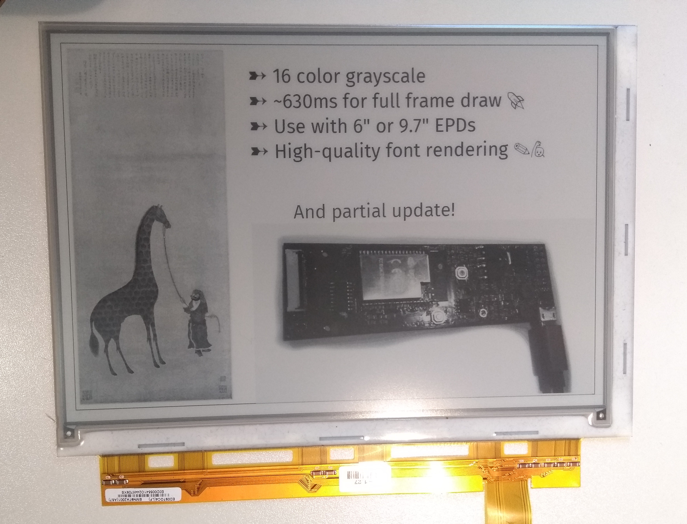
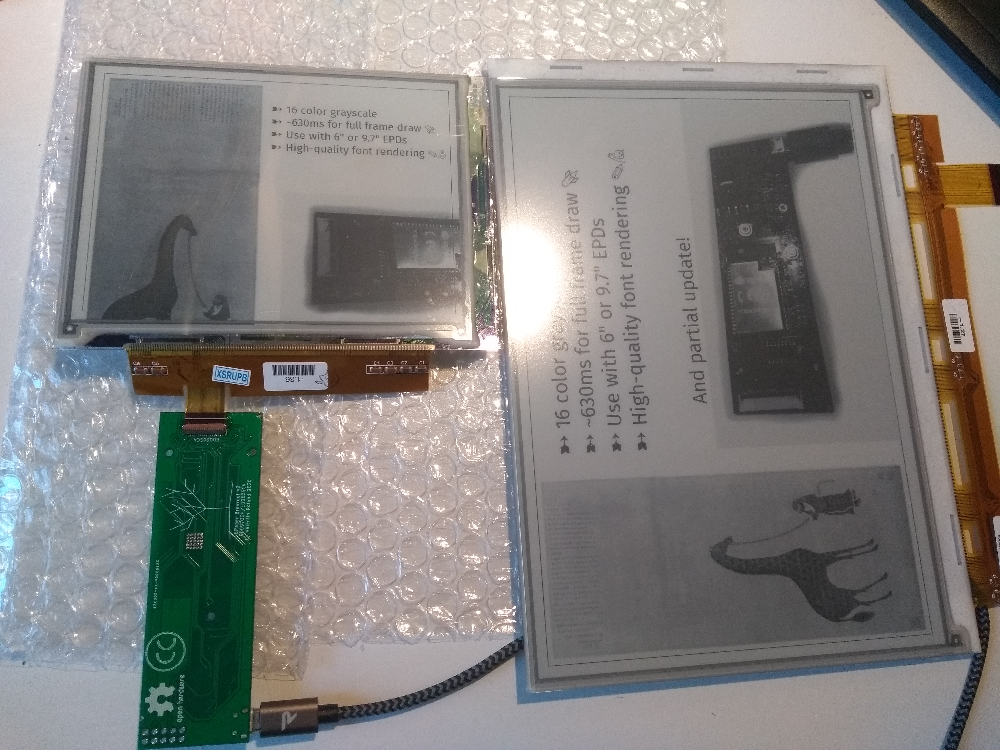
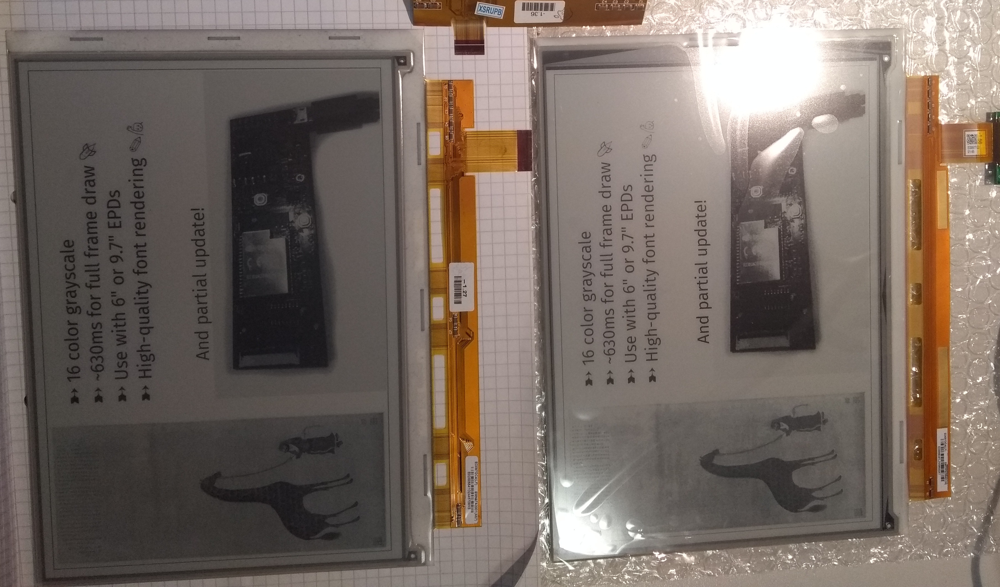

About
=====

EPDiy is a driver board for e-Paper (or E-ink) displays.

.. _display_types:

Display Types
-------------

The EPDiy driver board targets multiple E-Paper displays.
As the driving method for all matrix-based E-ink displays seems to be more or less the same, only the right connector and timings are needed. The EPDiy PCB features a 33pin, 34pin and a 39pin connector, which allow to drive a number of displays.
A table of supported displays is mainained in the :code:`README.md` file.

Some of the supported displays are showcased below.

ED097OC4
~~~~~~~~

The ED097OC4 was the original target of this project. It is an 9.7 inch screen, with a resolution of 1200 * 825 pixels (150dpi).
It is fairly available on Ebay and AliExpress, for around 30$ to 35$. 
There is also a lower contrast version (ED097OC1) which also works. 

ED060SC4
~~~~~~~~

This is a 6 inch display, with a 800 * 600 resolution. With 150dpi as well, it has about half the total display area of the ED097OC4.
To connect this display, the 39-pin connector on the back has to be populated.
It is also the display a lot of experimentation was done with (see Thanks To), so there are alternative controllers available.
Besides the obvious difference in size, this display is cheaper (~20$) and also refreshes slightly faster than the ED097OC4.

ED097TC2
~~~~~~~~

Information on this display should be taken with a grain of salt. One of the displays I ordered as ED097OC4 came as ED097TC2,
and upon testing it also exhibited noticably better contrast and a more responsive electro-phoretic medium. 
The ribbon connector looked like a ED097TC2 as well, or like the `9.7 inch screens offered by Waveshare <https://www.waveshare.com/9.7inch-e-Paper.htm>` (which is sold for a lot more).
If you are on the lookout for such a display keep in mind the authenticity of my sample is disputable and resolution and connector type should be double-checked.

